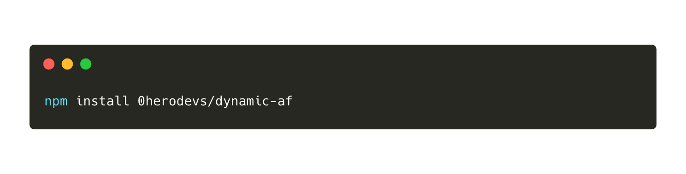
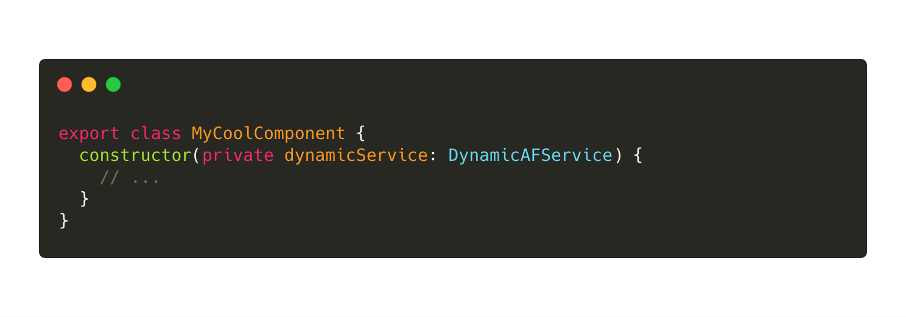
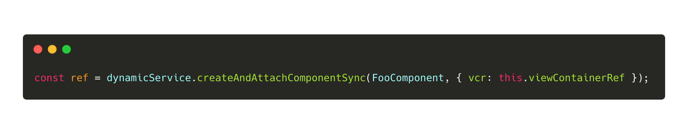
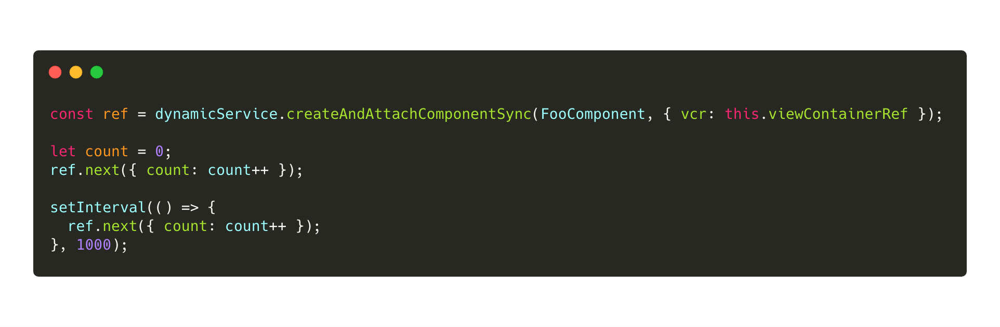

# DynamicAFService

A service that makes dynamically creating components easy.

When you use DynamicAFService to create a component, you are given
backed an `ICreatedComponentInterface` which allows you to do the
following three things:

- `.next()` - Push new data into the component's Inputs, as well
  as provide callbacks for the Outputs. This is how you pass new
  down into the created component.
- `.detach()` - Allows you to detach the component from the DOM
  as well as destroys the component. This is how you destroy the
  created component.
- `.componentRef` - This is a pointer to the created component.
  This is of type `ComponentRef`. In other words, this is the
  instance of the component that is returned when you call `new`
  on the class definition. The `.componentRef` is the `this` of
  the component.

### How to use it

#### Installation

Start by installing it correctly:

[comment]: https://carbon.now.sh/?bg=rgba(171%252C184%252C195%252C0)&t=monokai&wt=none&l=application%252Fx-sh&ds=false&dsyoff=20px&dsblur=68px&wc=true&wa=false&pv=48px&ph=32px&ln=false&fm=Hack&fs=14px&lh=133%2525&si=false&es=2x&wm=false&code=npm%252520install%252520%252540herodevs%25252Fdynamic-af

#### Inject the Service

Now you need to inject the service into your component, or into
another service of your own. You do that by adding it to the
constructor of your component/service, like so:

[comment]: https://carbon.now.sh/?bg=rgba(171%252C184%252C195%252C0)&t=monokai&wt=none&l=application%2Ftypescript&ds=false&dsyoff=20px&dsblur=68px&wc=true&wa=false&pv=48px&ph=32px&ln=false&fm=Hack&fs=14px&lh=133%2525&si=false&es=2x&wm=false&code=export%2520class%2520MyCoolComponent%2520%257B%250A%2520%2520constructor(private%2520dynamicService%253A%2520DynamicAFService)%2520%257B%250A%2520%2520%2520%2520%252F%252F%2520...%250A%2520%2520%257D%250A%257D

#### Call `createAndAttachComponentSync`

Now that you have the service, you can call the `createAndAttachComponentSync`
method to create a component and have it attached to the DOM.
Here is an example of what that looks like:

[comment]: https://carbon.now.sh/?bg=rgba(171%252C184%252C195%252C0)&t=monokai&wt=none&l=application%2Ftypescript&ds=false&dsyoff=20px&dsblur=68px&wc=true&wa=false&pv=48px&ph=32px&ln=false&fm=Hack&fs=14px&lh=133%2525&si=false&es=2x&wm=false&code=const%2520ref%2520%253D%2520dynamicService.createAndAttachComponentSync(FooComponent%252C%2520%257B%2520vcr%253A%2520this.viewContainerRef%2520%257D)%253B

You must pass the `createAndAttachComponentSync` method two
parameters. First, you need to pass the class of the component
that you want to dynamically create. The second is an
object that matches the `CreateComponentOptions` interface:

[comment]: https://carbon.now.sh/?bg=rgba(171%252C184%252C195%252C0)&t=monokai&wt=none&l=application%2Ftypescript&ds=false&dsyoff=20px&dsblur=68px&wc=true&wa=false&pv=48px&ph=32px&ln=false&fm=Hack&fs=14px&lh=133%2525&si=false&es=2x&wm=false&code=interface%2520CreateComponentOptions%2520%257B%250A%2520%2520%2520%2520module%253F%253A%2520NgModuleRef%253Cany%253E%253B%250A%2520%2520%2520%2520context%253F%253A%2520%257B%2520%255Bkey%253A%2520string%255D%253A%2520any%2520%257D%253B%250A%2520%2520%2520%2520vcr%253F%253A%2520ViewContainerRef%253B%250A%257D

Here are what each of those represents:

- `vcr (optional, but not really)` - This is the `ViewContainerRef`
  where you want to attach the createdComponent. If you don't
  provide a `vcr`, the service will have no choice but to attach
  your component to the bottom of the `document.body`. So it
  is recommended that you DEFINITELY provide a `vcr`.
- `context (optional)` - This is an object that has keys
  that match the names of the Inputs/Outputs of the component
  being created. If your component being created has an
  input named `name`, then you can pass a `context` with
  a `name` property to provide a name. Eg: `{name: 'Your Name'}`.
  This will pass the value `Your Name` into the Input
  of you component.
- `module (optional)` - This is a reference to the module
  that the component belongs to. You only need to pass this
  if you manually lazily loaded the component and module.
  Otherwise you can not pass this.

#### Updating input/output values

Once you have the `ref` to your created component, you can
call `next(newContext)` to pass in new values to your
inputs/outputs of your component. Here is an example of
updating an input value one second for a component
that has `@Input() count`:

[comment]: https://carbon.now.sh/?bg=rgba(171%2C184%2C195%2C0)&t=monokai&wt=none&l=application%2Ftypescript&ds=false&dsyoff=20px&dsblur=68px&wc=true&wa=false&pv=48px&ph=32px&ln=false&fm=Hack&fs=14px&lh=133%25&si=false&es=2x&wm=false&code=const%2520ref%2520%253D%2520dynamicService.createAndAttachComponentSync(FooComponent%252C%2520%257B%2520vcr%253A%2520this.viewContainerRef%2520%257D)%253B%250A%250Alet%2520count%2520%253D%25200%253B%250Aref.next(%257B%2520count%253A%2520count%252B%252B%2520%257D)%253B%250A%250AsetInterval(()%2520%253D%253E%2520%257B%250A%2520%2520ref.next(%257B%2520count%253A%2520count%252B%252B%2520%257D)%253B%250A%257D%252C%25201000)%253B

Once a second the created component will get a new `count`
via it's input.
